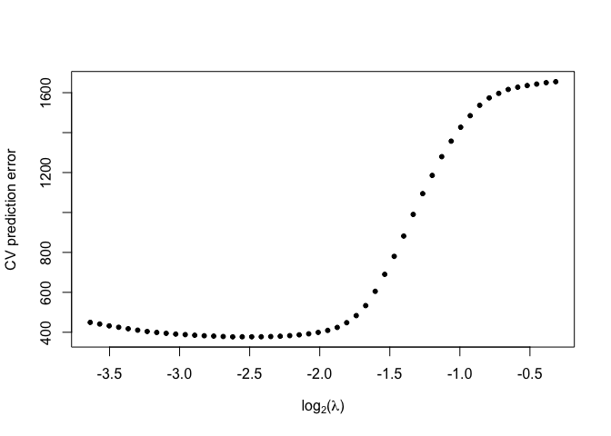
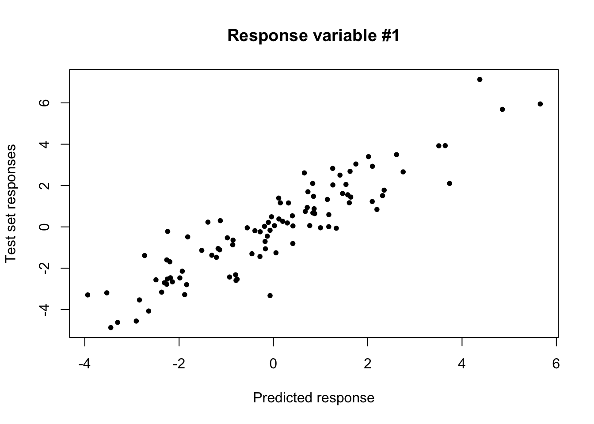
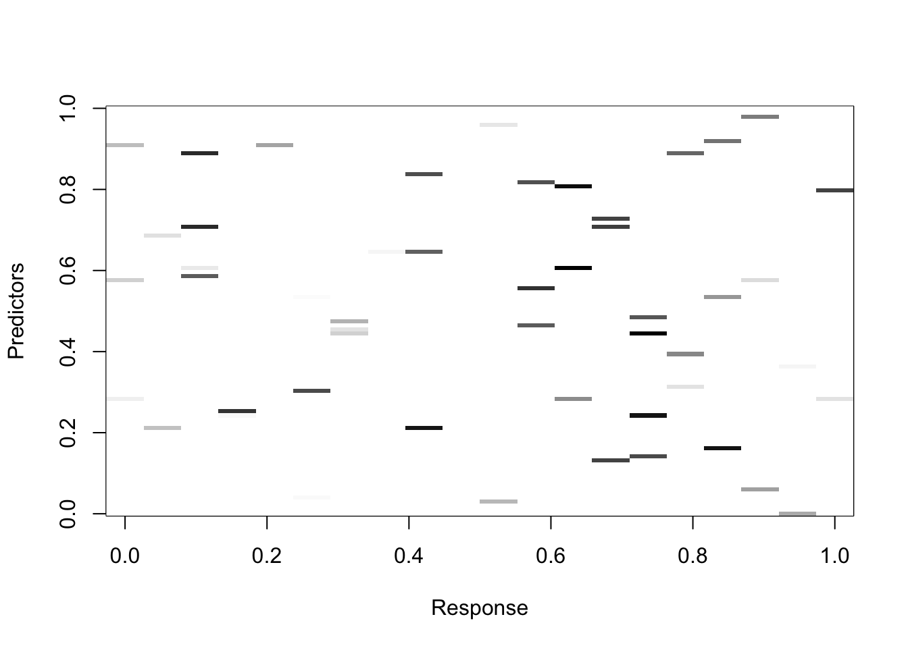

Please send comments or feedback to $\texttt{amolstad@ufl.edu}$. 


### Load package

We first load in the R package from Github. 

```r
library(Matrix)
source("~/Documents/GitHub/MSRL/R/MSRL_Functions.R")
```
### The multivariate square-root lasso
The multivariate square-root lasso estimator, in full generality, is
\begin{equation}\label{eq:MSRL}
\arg\min_\beta \left\{ \frac{1}{\sqrt{n}}\|\mathbf{Y} - \mathbf{X}\beta\|_* + \lambda \sum_{j,k}w_{j,k}|\beta_{j,k}|\right\}.
\end{equation}
where the $w_{j,k}$ are weights to be defined later. Note that here, the $\mathbf{Y}$ and $\mathbf{X}$ in the definition have been centered by their columnwise means (to remove the intercept). The $Y$ and $X$ input into the function should not be centered. 


### Generate data
To demonstrate how to use the R package, we generate some data from Model 1 of the article "Insights and algorithms for the multivariate square-root lasso". 

```r
# --------------------------------
# Preliminaries
# --------------------------------
set.seed(1)
p = 100
n = 70
q = 20
ntest = 100

# --------------------------------
# Generate predictors
# --------------------------------
SigmaX <- matrix(0, nrow=p, ncol=p)
for(k in 1:p){
  for(j in 1:p){
    SigmaX[j,k] <- .5^abs(j-k)
  }
}
diag(SigmaX) <- 1
eo <- eigen(SigmaX)
SigmaXsqrt <- eo$vec%*%diag(eo$val^.5)%*%t(eo$vec)
X <- matrix(rnorm(n*p), nrow=n)%*%SigmaXsqrt
Xtest <- matrix(rnorm(ntest*p), nrow=ntest)%*%SigmaXsqrt
# -----------------------------------
# Generate regression coefficients
# -----------------------------------
beta <- matrix(0, nrow=p, ncol=q)
beta[sample(1:(p*q), floor(p*q)*.04, replace=TRUE)] <- 1

# -------------------------------------
# Generate responses
# -------------------------------------
Sigma <- matrix(0, nrow=q, ncol=q)
for(k in 1:q){
  for(j in 1:q){
    Sigma[j,k] <- .9^abs(j-k)
  }
}
diag(Sigma) <- 1
eo <- eigen(Sigma)
Sigmasqrt <- eo$vec%*%diag(eo$val^.5)%*%t(eo$vec)
Y = X%*%beta + matrix(rnorm(n*q), nrow=n)%*%Sigmasqrt
Ytest = Xtest%*%beta + matrix(rnorm(ntest*q), nrow=ntest)%*%Sigmasqrt
```
First, we show how to fit the model without cross-validation. By setting the argument $\texttt{nfolds = NULL}$. To track progress, we use the argument $\texttt{quiet = FALSE}$. Since $n > q$, we leave $\texttt{ADMM = FALSE}$ -- the function will switch to ADMM automatically if the residual matrix has fewer than $q$ nonzero singular values. 

```r
mod1 <- MSRL.cv(X = X, Y = Y, nlambda = 10, standardize = FALSE, ADMM = FALSE, nfolds = NULL,  weighted = FALSE,  delta = .25, tol = 1e-8, quiet = FALSE, inner.quiet=TRUE)
```

```
## 1 : non-zero =  0 
## # ------------------------------  
## 2 : non-zero =  3 
## # ------------------------------  
## 3 : non-zero =  12 
## # ------------------------------  
## 4 : non-zero =  30 
## # ------------------------------  
## 5 : non-zero =  57 
## # ------------------------------  
## 6 : non-zero =  77 
## # ------------------------------  
## 7 : non-zero =  102 
## # ------------------------------  
## 8 : non-zero =  128 
## # ------------------------------  
## 9 : non-zero =  180 
## # ------------------------------  
## 10 : non-zero =  269 
## # ------------------------------
```

If we set $\texttt{inner.quiet = FALSE}$ and $\texttt{ADMM = FALSE}$, we also print the residuals based on the first order conditions printed after every 50 iterations.
$$ r_1 = \frac{\sum_{j,k}  1\left(\hat{\beta}_{j,k} = 0 \cap |[XUV']_{j,k}| \geq \sqrt{n} w_{j,k}\lambda\right) }{\sum_{j,k}  1(\hat{\beta}_{j,k} = 0)},$$
and 
$$ r_2 = \max_{j,k} |\frac{1}{\sqrt{n}}[XUV']_{j,k} - w_{j,k}\lambda {\rm sign}(\hat{\beta}_{j,k})|$$
where $(U,D,V) = {\rm svd}(Y - X\hat{\beta})$.
This argument may be useful if convergence is slow. 


```r
mod2 <- MSRL.cv(X = X, Y = Y, nlambda = 10, standardize = FALSE, ADMM = FALSE, nfolds = NULL, weighted = FALSE,   delta = .25, tol = 1e-8, quiet = TRUE, inner.quiet=FALSE)
```

```
## 10 : r1 =  0 r2 =  0.0001640287 
## # ---------------  
## 10 : r1 =  0 r2 =  0.001194811 
## 20 : r1 =  0 r2 =  3.93894e-06 
## # ---------------  
## 10 : r1 =  0 r2 =  0.003982984 
## 20 : r1 =  0 r2 =  1.079921e-05 
## # ---------------  
## 10 : r1 =  0 r2 =  0.008997599 
## 20 : r1 =  0 r2 =  0.0004852638 
## 30 : r1 =  0 r2 =  3.403486e-05 
## # ---------------  
## 10 : r1 =  0 r2 =  0.03393725 
## 20 : r1 =  0 r2 =  0.003066269 
## 30 : r1 =  0 r2 =  0.0001071162 
## 40 : r1 =  0 r2 =  4.258364e-06 
## # ---------------  
## 10 : r1 =  0.0005265929 r2 =  0.05975512 
## 20 : r1 =  0 r2 =  0.01157984 
## 30 : r1 =  0 r2 =  0.001390923 
## 40 : r1 =  0 r2 =  8.467145e-05 
## 50 : r1 =  0 r2 =  1.123208e-05 
## # ---------------  
## 10 : r1 =  0.005367687 r2 =  0.2217668 
## 20 : r1 =  0 r2 =  0.00741005 
## 30 : r1 =  0 r2 =  0.000178655 
## 40 : r1 =  0 r2 =  8.707024e-06 
## # ---------------  
## 10 : r1 =  0.006651885 r2 =  0.1896867 
## 20 : r1 =  0.000550055 r2 =  0.0262526 
## 30 : r1 =  0 r2 =  0.002305897 
## 40 : r1 =  0 r2 =  9.307485e-05 
## 50 : r1 =  0 r2 =  4.642228e-06 
## # ---------------  
## 10 : r1 =  0.02447761 r2 =  0.3487406 
## 20 : r1 =  0.002898551 r2 =  0.03366605 
## 30 : r1 =  0 r2 =  0.002569009 
## 40 : r1 =  0 r2 =  0.000633241 
## 50 : r1 =  0 r2 =  7.580511e-05 
## 60 : r1 =  0 r2 =  1.927538e-05 
## # ---------------
```
Checking the out, we have: 

```r
str(mod2)
```

```
## List of 13
##  $ beta        :Formal class 'dgCMatrix' [package "Matrix"] with 6 slots
##   .. ..@ i       : int [1:858] 508 660 1256 470 508 540 660 746 786 839 ...
##   .. ..@ p       : int [1:11] 0 0 3 15 45 102 179 281 409 589 ...
##   .. ..@ Dim     : int [1:2] 2000 10
##   .. ..@ Dimnames:List of 2
##   .. .. ..$ : NULL
##   .. .. ..$ : NULL
##   .. ..@ x       : num [1:858] 0.00633 0.37865 0.07073 0.02591 0.37535 ...
##   .. ..@ factors : list()
##  $ sparsity.mat: num [1:10] 0 3 12 30 57 77 102 128 180 269
##  $ err.pred    : NULL
##  $ err.wpred   : NULL
##  $ err.spec    : NULL
##  $ err.nuc     : NULL
##  $ Y.offset    : num [1:20] 0.333 0.009 0.04 0.186 -0.222 ...
##  $ X.offset    : num [1:100] 0.1468 0.0199 0.0464 -0.027 0.0928 ...
##  $ Y.sd        : num [1:20] 2.5 3.29 2.72 2.8 1.7 ...
##  $ X.sd        : num [1:100] 0.938 0.831 1.099 1.012 0.951 ...
##  $ lambda.vec  : num [1:10] 0.803 0.689 0.59 0.506 0.434 ...
##  $ lam.min     : NULL
##  $ standardize : logi FALSE
##  - attr(*, "class")= chr "MSRL"
```
Note that $\beta$ for all candidate tuning parameters is stored as a sparse matrix -- to extract coefficients, use the MSRL.coef function detailed below. 


### Cross-validation
Now we set \texttt{nfolds = 5} to perform 5-fold cross-validation.  Note that this actually fits the model $\texttt{nfolds} + 1$ times since it first fits the model to the entire dataset. 

```r
mod3 <- MSRL.cv(X = X, Y = Y, nlambda = 50, standardize = FALSE, ADMM = FALSE, nfolds = 5,  weighted = FALSE, delta = .1, tol = 1e-8, quiet = TRUE, inner.quiet=TRUE)
```

In the output, there are four different metrics used to measure performance in cross-validation. Let $Y_{-k}$ and $X_{-k}$ be the left-out-fold responses and predictors which have been centered (standardized) based on the left-in-fold data. The metrics are: 

- $\texttt{err.pred}$: squared Frobenius norm prediction error $$\|Y_{-k} - X_{-k} \hat{\beta}_{k}\|_F^2,$$ 

- $\texttt{err.wpred}$: weighted squared Frobenius norm prediction error 
$$ {\rm tr}\left\{(Y_{-k} - X_{-k}\hat{\beta}_{k})W_{-k}(Y_{-k} - X_{-k}\hat{\beta}_{k})'\right\}$$
where $W_{-k}$ is a diagonal matrix with the left-out-fold inverse variances along its diagonal. 

- $\texttt{err.nuc}$: nuclear norm prediction error
$$\|Y_{-k} - X_{-k} \hat{\beta}_{k}\|_*,$$ 
- $\texttt{err.spec}$: spectral norm prediction error. 
$$\|Y_{-k} - X_{-k} \hat{\beta}_{k}\|.$$


```r
plot(x = log2(mod3$lambda.vec), y = rowMeans(mod3$err.pred), pch=20, xlab=expression(paste(log[2], "(", lambda,")", sep="")), ylab="CV prediction error")
```

<!-- -->


### Additional options

The other options work as follows: 

- $\texttt{standardize}$: this is a TRUE/FALSE argument set to FALSE as default. When false, the $X$ used in model fitting is 
$$ \mathbf{X} = X - 1_n \bar{X}',$$
where $\bar{X} = n^{-1}\sum_{i=1}^n x_i$. When TRUE, the $X$ used for model fitting is standardized: 
$$ \mathbf{X} = (X - 1_n \bar{X}')/(1_n \bar{\sigma}_X'),$$
where $\bar{\sigma}_X$ is the $p$-dimensional standard deviations for each of the $p$ predictors. All necessary adjustments are made inside the cross-validation function, in addition to both the prediction and coefficient functions. 

- $\texttt{weighted}$ is a TRUE/FALSE argument. We do not recommend standardizing the response variables (and do not provide an option to do so in our software) so to adjust the level of penalty applied to $\beta$. When $\texttt{weighted = FALSE}$, all $w_{j,k} = 1$; when $\texttt{weighted = TRUE}$, all $$w_{j,k} = \frac{1}{\bar{\sigma_{y}}_{k}},$$
where $\bar{\sigma_{y}}_{k}$ is the marginal standard deviation for the $k$th response variable. 

- $\texttt{delta}$ is the parameter $<1$ which specifies the range of candidate tuning parameters we consider. That is, we automatically select $\lambda_{\rm max}$, and we consider tuning parameters as small as 
$$\lambda_{\rm min}  = \delta \lambda_{\rm max}.$$

- $\texttt{tol}$ is the convergence tolerance. If not the default, we recommend model fitting with \texttt{inner.quiet = TRUE} to track progress. 

### Predictions 
We can obtain predicted values for a new set of predictors. As a default tuning parameter after cross-validation, we use the tuning parmaeter which minimizes the square Frobenius norm prediction error.  

```r
fitted.preds <- MSRL.predict(Xnew = Xtest, fit = mod3, lambda = mod3$lam.min)
str(fitted.preds)
```

```
## List of 3
##  $ pred : num [1:100, 1:20] -3.014 -2.128 -1.169 1.041 -0.407 ...
##  $ beta0: num [1:20, 1] 0.091 0.0359 0.0886 0.1198 0.047 ...
##  $ beta : num [1:100, 1:20] 0.988 0.896 0 0 0 ...
```

```r
fitted.preds$pred[1:10, 1:10]
```

```
##             [,1]       [,2]         [,3]        [,4]         [,5]
##  [1,] -3.0137795  1.8058695  1.755825601 -1.98837391  1.207177745
##  [2,] -2.1277607 -1.4631383  0.004561966  0.92992753 -0.179335622
##  [3,] -1.1694368 -0.3081326 -0.661315260 -4.51412249  0.221789097
##  [4,]  1.0406221 -2.0629495  0.834131586 -0.60879231 -0.833935124
##  [5,] -0.4069333 -2.3205586  1.270312538 -2.12087468 -1.755480040
##  [6,]  0.7670882  2.6634582  2.861326120  0.01334675 -0.797299449
##  [7,] -1.6825697  0.8444562 -2.615324788  0.87865820 -0.004108019
##  [8,]  0.9363262 -0.4578183  0.424504198  1.49069714  3.140748412
##  [9,]  1.3428808 -1.5398008 -1.522554439  3.75064472 -0.655868378
## [10,]  4.2140671  3.0119176 -0.351374471  1.88477782 -1.461524248
##             [,6]       [,7]       [,8]        [,9]       [,10]
##  [1,] -1.0048091 -0.9712164  0.3668056  0.57994544  1.16136308
##  [2,] -0.3815499  1.7224711 -1.0825482  0.41384612 -4.09704667
##  [3,]  0.8272657  3.6674321  0.2050776  0.56763225  2.42732619
##  [4,]  0.7382315 -1.6369089  0.7570054  1.47836621 -1.34181376
##  [5,] -0.7964030 -4.7310280  2.0722399  0.82288130  1.05995948
##  [6,] -0.5240986  0.8668913  1.4231917 -0.60454091  4.22912962
##  [7,] -0.4241935  2.7316738 -2.3514802 -1.07033463  0.47745230
##  [8,] -1.1591924 -1.7449532 -0.3560957 -1.60904136 -1.58189712
##  [9,] -0.4740628  0.3931523 -0.4656451  0.01044879 -5.44290732
## [10,] -0.2169671  1.4799308 -1.7918599 -0.38286407 -0.02914546
```

```r
plot(fitted.preds$pred[,1], Ytest[,1], pch=20, ylab="Test set responses", xlab="Predicted response", main="Response variable #1")
```

<!-- -->


Finally, we can also extract both the regression coefficient matrix and intercept. Note that the intercept has the form 
$$ \hat{\beta}_0 = \bar{Y} - \hat{\beta}'\bar{X}.
$$

```r
fitted.coefs <- MSRL.coef(fit = mod3, lambda = mod3$lambda.vec[12])
str(fitted.coefs)
```

```
## List of 2
##  $ beta0: num [1:20, 1] 0.3119 0.009 0.0507 0.178 -0.0887 ...
##  $ beta : num [1:100, 1:20] 0.144 0 0 0 0 ...
```

```r
image(t(abs(fitted.coefs$beta)), xlab="Response", ylab="Predictors", col = grey(100:0/100))
```

<!-- -->


